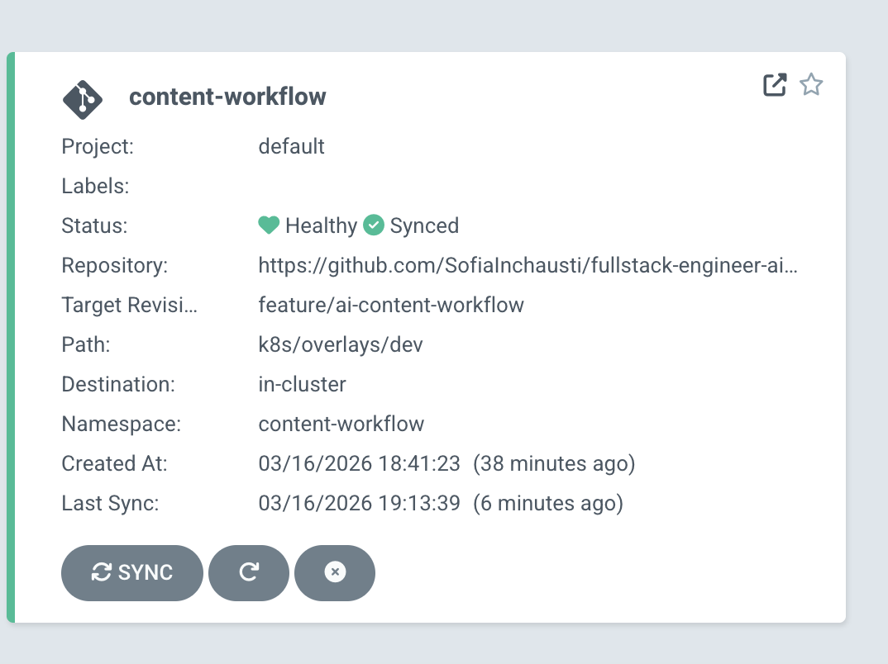

# AI Content Workflow

Fullstack application to create multi-piece, multi-localization marketing campaigns with AI suggestions and human review.

It includes:

- Backend API with NestJS + TypeORM
- Frontend UI with React + Vite
- PostgreSQL for persistence
- Redis pub/sub for async realtime events
- Socket.IO for live progress and status updates
- Docker Compose for local fullstack execution
- Kubernetes + Argo CD manifests for GitOps-style deployment

## Core Features

- Create campaigns by topic, provider, model, and localizations
- Auto-generate default content pieces and localization drafts with AI
- Review workflow per localization:
  - `DRAFT -> AI_SUGGESTED -> REVIEWED -> APPROVED/REJECTED`
- Inline editing for AI suggestions
- Realtime events for processing and status transitions
- Dashboard + create flow with live progress timeline + campaign detail review view

## Tech Stack

- Frontend: React, TypeScript, Vite, Socket.IO client
- Backend: NestJS, TypeScript, TypeORM, Swagger
- AI: OpenAI + Anthropic (via LangChain model clients)
- Data: PostgreSQL
- Realtime/async: Redis pub/sub + Socket.IO gateway
- Tooling: ESLint, Prettier, Jest
- Infra: Docker Compose, Kubernetes (kustomize), Argo CD

## Repository Structure

```txt
.
├── backend/
│   ├── src/
│   ├── test/
│   └── Dockerfile
├── frontend/
│   ├── src/
│   └── Dockerfile
├── docs/
├── k8s/
├── argocd/
├── compose.yml
├── .env.example
└── README.md
```

## Environment Variables

Use root `.env` (recommended and currently wired for Compose).

1) Create your local file:

```bash
cp .env.example .env
```

2) Fill values in `.env`:

- `DB_HOST`
- `DB_PORT`
- `DB_USER`
- `DB_PASSWORD`
- `DB_NAME`
- `OPENAI_API_KEY`
- `ANTHROPIC_API_KEY` (optional if not used)
- `SEED_ON_BOOT`
- `REDIS_HOST`
- `REDIS_PORT`
- `REDIS_EVENTS_CHANNEL`

## Run Locally (Docker Compose)

This is the fastest way to run the entire app.

```bash
docker compose up --build
```

Services:

- Frontend: [http://localhost:5173](http://localhost:5173)
- Backend API: [http://localhost:3000](http://localhost:3000)
- Swagger: [http://localhost:3000/docs](http://localhost:3000/docs)
- PostgreSQL (host): `localhost:5435`
- Redis (host): `localhost:6379`

## Run Without Docker (Optional)

### Backend

```bash
cd backend
npm ci
npm run build
npm start
```

### Frontend

```bash
cd frontend
npm ci
npm run dev
```

## API Overview

Main endpoints:

- `POST /campaigns` - Create campaign and trigger generation workflow
- `GET /campaigns` - List campaigns for dashboard
- `GET /campaigns/:id` - Campaign details with pieces/localizations
- `POST /campaigns/:id/pieces` - Add content piece to campaign
- `PATCH /content-localizations/:id/content` - Edit generated content
- `PATCH /content-localizations/:id/status` - Transition review status
- `GET /ai/models?provider=openai|anthropic` - Dynamic model list

## Realtime Events

Socket.IO campaign room event flow includes:

- `campaign:join`
- `content:processing`
- `content:suggested`
- `content:update`
- `status:change`
- `generation:completed`

The frontend consumes these events to show live generation progress and status updates.

## Tests

Backend tests are organized by level:

- `test/unit/...`
- `test/integration/...`
- `test/e2e/...`

Run:

```bash
cd backend
npm test
npm run test:integration
npm run test:e2e
```

## Lint and Formatting

### Backend

```bash
cd backend
npm run lint
npm run format:check
```

### Frontend

```bash
cd frontend
npm run lint
npm run format:check
```

## CI

GitHub Actions workflow runs:

- Backend build + tests
- Frontend lint + build

Workflow file:

- `.github/workflows/ci.yml`

## Kubernetes and Argo CD

Kubernetes manifests:

- `k8s/base`
- `k8s/overlays/dev`

Argo CD app manifest:

- `argocd/application.yaml`

## Argo CD running

Argo CD application status in local Kubernetes (`docker-desktop`):



Deploy with kubectl:

```bash
kubectl apply -k k8s/overlays/dev
```

Deploy Argo CD Application (after Argo CD installation):

```bash
kubectl apply -f argocd/application.yaml
```

Important:

- Replace placeholder image names in `k8s/` with your registry images
- Update secrets (`k8s/base/app-secret.yaml`) before deploying
- Ensure `argocd/application.yaml` points to your fork/repo and correct branch/path

## Project Docs

See:

- `docs/architecture.md`
- `docs/workflow.md`
- `docs/database.md`
- `docs/realtime-updates.md`
- `docs/system-design-decisions.md`
- `docs/infrastructure-devops-decisions.md`