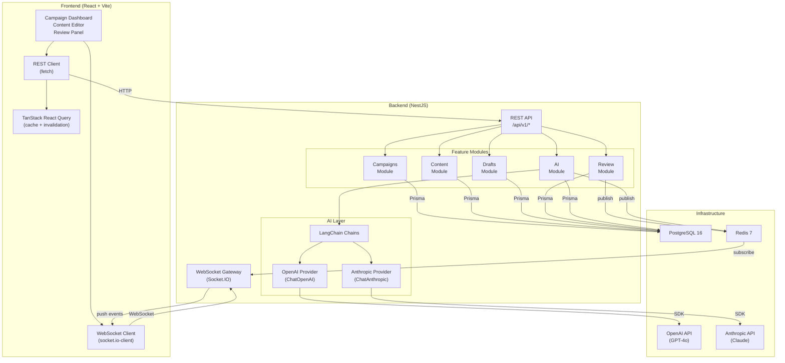
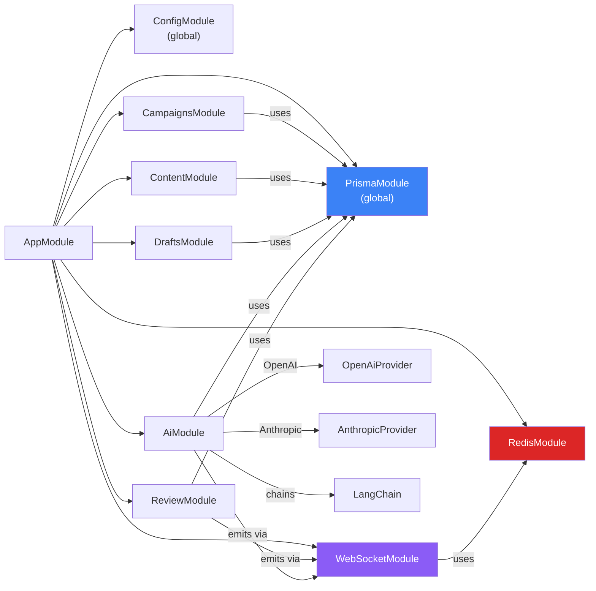
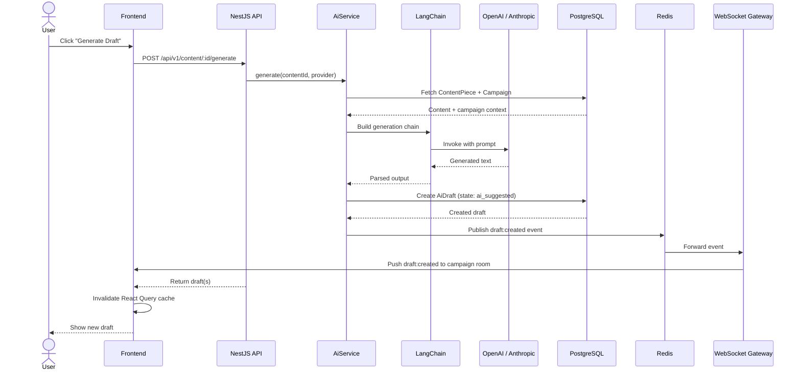
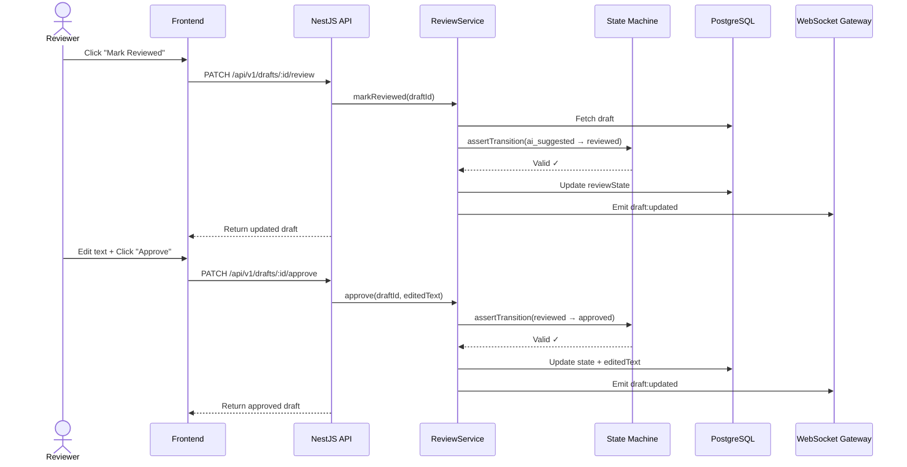
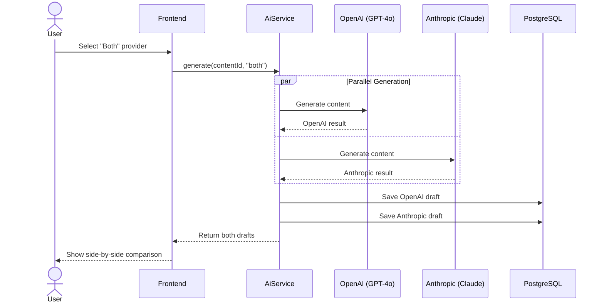
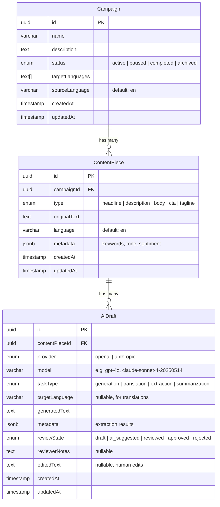
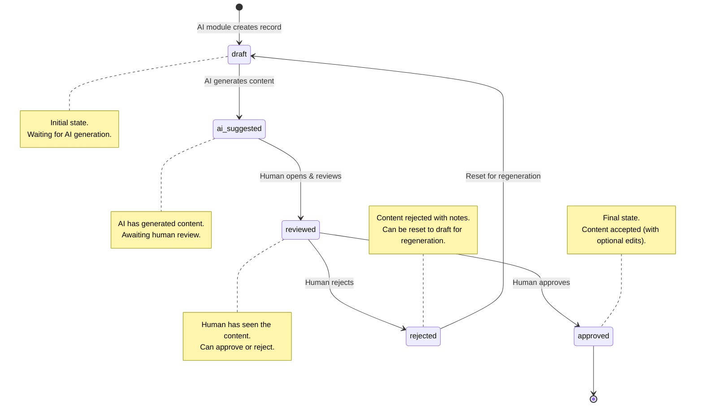
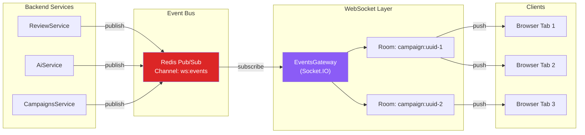

# Architecture — AI Content Workflow

> Detailed architecture documentation with diagrams for the ACME Content Workflow system.

---

## System Architecture

---

## Module Dependency Graph

| Module | Responsibility | Dependencies |
|---|---|---|
| `PrismaModule` | Database client, connection management | PostgreSQL |
| `RedisModule` | Shared Redis client, pub/sub helpers | Redis |
| `WebSocketModule` | Socket.IO gateway, room management, event broadcasting | RedisModule |
| `CampaignsModule` | CRUD for campaigns, pagination, filtering | PrismaModule |
| `ContentModule` | CRUD for content pieces within campaigns | PrismaModule |
| `DraftsModule` | Query AI drafts by content piece | PrismaModule |
| `AiModule` | AI generation, translation, extraction via LangChain | PrismaModule, OpenAI, Anthropic |
| `ReviewModule` | Review workflow state machine, transition validation | PrismaModule, WebSocketModule |

---

## Data Flow Diagrams

### AI Content Generation Flow

### Review Workflow Flow

### Multi-Provider Comparison Flow

---

## Database Schema (ERD)

---

## Review State Machine

### Valid Transitions

| From | To | Trigger | HTTP Endpoint |
|---|---|---|---|
| `draft` | `ai_suggested` | AI generates content | `POST /content/:id/generate` |
| `ai_suggested` | `reviewed` | Human opens and reviews | `PATCH /drafts/:id/review` |
| `reviewed` | `approved` | Human approves (optional edits) | `PATCH /drafts/:id/approve` |
| `reviewed` | `rejected` | Human rejects (optional notes) | `PATCH /drafts/:id/reject` |
| `rejected` | `draft` | Reset for regeneration | `PATCH /drafts/:id/reset` |

Any invalid transition returns a **409 Conflict** response.

---

## Real-Time Event Architecture

### Event Types

| Event | Payload | Trigger |
|---|---|---|
| `draft:created` | `{ draftId, contentPieceId, campaignId, provider }` | AI generates a new draft |
| `draft:updated` | `{ draftId, reviewState, updatedAt }` | Review state changes |
| `campaign:updated` | `{ campaignId, field, value }` | Campaign details modified |
| `content:updated` | `{ contentPieceId, campaignId }` | Content piece modified |

Clients join rooms by `campaignId` on navigation and leave when navigating away. The frontend `useRealtimeUpdates` hook automatically invalidates relevant React Query caches when events arrive, ensuring the UI stays in sync without manual refreshes.
