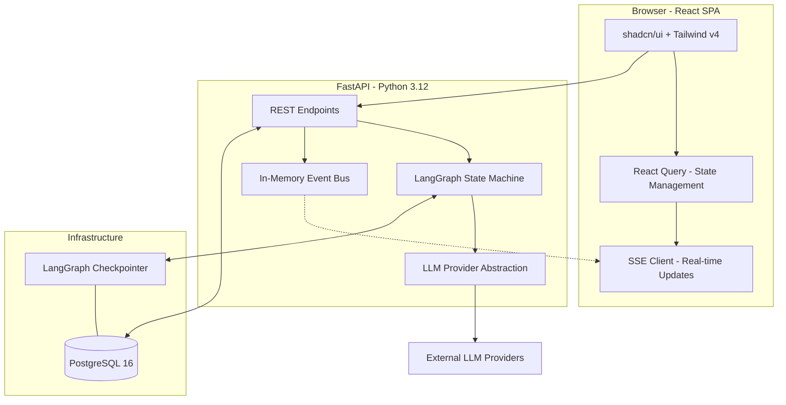

# Architecture

This document describes the technical architecture of the ACME Global Media content workflow system.

## High-Level System Overview

The system is a full-stack application designed to automate and manage a multilingual content creation lifecycle. It combines an AI-driven state machine (LangGraph) with a modern web interface (React) and a robust backend (FastAPI).

## Core Components

### 1. Frontend Architecture

Built with **React 19**, **Vite**, and **TypeScript**.

- **Styling**: Tailwind CSS v4 for utility-first styling, with **shadcn/ui** for high-quality accessible components.
- **State Management**: **TanStack Query (React Query)** handles all server state, caching, and optimistic updates.
- **Real-time**: Custom `SSEProvider` context manages long-lived connections to the backend, dispatching events to UI components for instant feedback on workflow progress and token streaming.

### 2. Backend Architecture

Built with **FastAPI**, leveraging Python's async capabilities.

- **API Design**: Pragmatic REST API for CRUD operations on campaigns and content.
- **Asynchronous Processing**: Background tasks handle long-running LLM workflows, ensuring the API remains responsive.
- **Event Bus**: An in-memory `asyncio.Queue` based pub/sub system handles real-time event distribution (SSE) to connected clients.
- **Dependency Injection**: FastAPI's DI system manages database sessions, service instances, and AI providers.

### 3. AI Workflow (LangGraph)

The heart of the system is a stateful workflow managed by **LangGraph**.

- **State Machine**: Orchestrates the transition from `initial_draft` → `extract_metadata` → `translate` (parallel fan-out) → `await_human_review`.
- **Human-in-the-Loop**: Uses LangGraph's `interrupt()` primitive to pause execution for human approval or feedback. State is persisted in PostgreSQL, allowing workflows to resume across server restarts.
- **Provider Abstraction**: A unified `LLMProvider` interface allows switching between Anthropic (Claude), OpenAI (GPT-4), and Mock providers for testing without changing business logic.
- **Streaming**: Supports real-time token streaming from LLMs, which is piped through the Event Bus to the frontend.

### 4. Data Model & Persistence

- **Database**: **PostgreSQL 16** serves as the single source of truth for application data and AI state.
- **ORM**: **SQLAlchemy 2.0** with async support and strict Pydantic v2 validation.
- **Entities**:
  - `Campaign`: High-level containers for content marketing efforts.
  - `ContentPiece`: Specific assets (headlines, CTAs) within a campaign.
  - `Draft`: Versioned outputs (original + translations) with status and metadata.
  - `WorkflowRun`: Tracking record for LangGraph execution threads.
- **Migrations**: Managed by **Alembic**, ensuring schema evolution is versioned and reproducible.

## Key Design Patterns

### Real-Time Updates (SSE)

Instead of polling or complex WebSockets, the system uses **Server-Sent Events (SSE)**.

1. A node in the LangGraph (e.g., `generate_draft`) publishes events to the `InMemoryEventBus`.
2. The SSE endpoint (`/api/v1/campaigns/{id}/events`) subscribes to the topic.
3. Events are streamed to the browser, where the UI updates in real-time.

### Human-in-the-Loop Workflow

The workflow is designed to be asynchronous:

1. User triggers generation.
2. Graph runs until `await_human_review`, then **interrupts** and saves its state.
3. The UI shows the piece as "Awaiting Review".
4. User submits "Approve" or "Regenerate".
5. The API resumes the graph with the provided feedback.

## Security & Observability

- **Environment**: Secrets managed via `.env` files (not committed).
- **Observability**: Built-in support for cost tracking (tokens) and latency logging. Extensible to include **LangSmith** for deep trace analysis.
- **Validation**: Strict schema validation at the database level (Enums, FKs) and API level (Pydantic).

## Architecture Decision Records (ADR)

Detailed design justifications can be found in `docs/adr/`:

- [ADR 0001 — Stack Selection](adr/0001-stack-selection.md)
- [ADR 0002 — AI Provider Abstraction](adr/0002-ai-provider-abstraction.md)
- [ADR 0003 — LangGraph Workflow Design](adr/0003-langgraph-workflow-design.md)
- [ADR 0004 — Human-in-the-loop Design](adr/0004-human-in-the-loop-design.md)
- [ADR 0005 — SSE Real-time Updates](adr/0005-sse-realtime.md)
