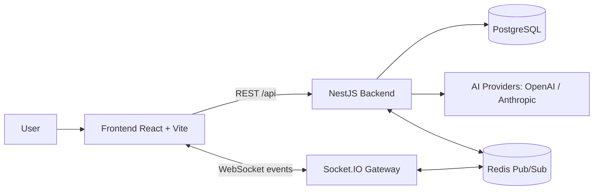
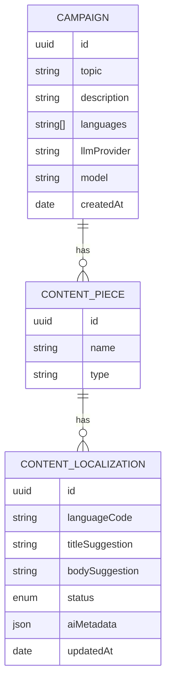

# Architecture Overview

This project is a fullstack AI-assisted content workflow platform with a human review loop.

## High-level diagram

## Backend modules

- `campaign`: create/list campaigns and orchestrate campaign-level operations.
- `content-piece`: manage piece definitions inside a campaign (example: email, banner, social post).
- `content-localization`: edit generated content and review status transitions.
- `ai`: provider model discovery + AI generation.
- `events`: Redis pub/sub event bus.
- `realtime`: WebSocket gateway for live UI updates.
- `seed`: demo data initialization (configurable with `SEED_ON_BOOT`).

## Domain flow

`Campaign` is the root aggregate and contains multiple `ContentPiece` records.
Each `ContentPiece` contains multiple localized suggestions in `ContentLocalization`.

## Data model

## Runtime/deployment options

- Local development: `docker compose up --build`
- Kubernetes: manifests under `k8s/` with `kustomize` overlay
- GitOps: Argo CD `Application` under `argocd/application.yaml`
