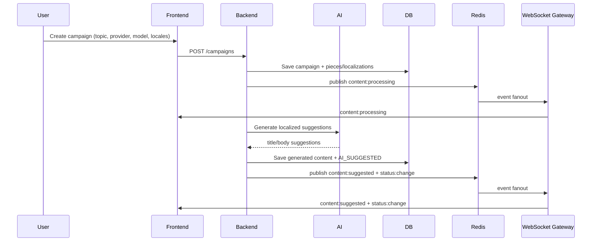
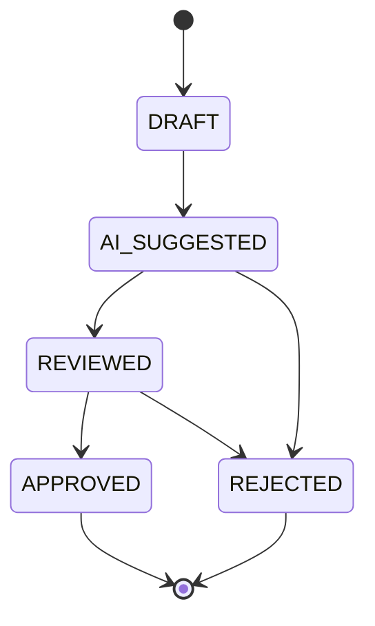

# Content Workflow

This workflow combines AI draft generation with manual review and live updates.

## Campaign creation and generation

## Review lifecycle

Notes:

- Editing content in non-final states sets status to `REVIEWED`.
- Final states (`APPROVED`, `REJECTED`) block further content edits.
- Every significant transition emits real-time events for connected clients.

## Realtime events used

- `campaign:join`
- `content:processing`
- `content:suggested`
- `content:update`
- `status:change`
